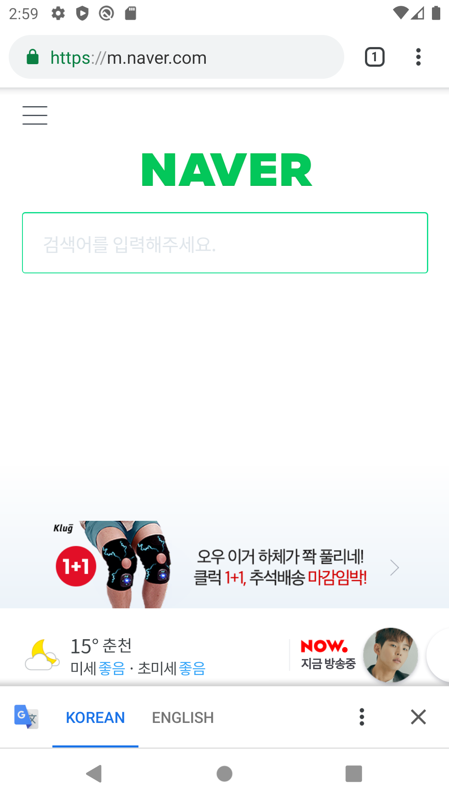

# 19173013 김한별

## 1주차 과제
    </img>
    
## 2주차 과제
     </img>
     
## 3주차 과제
    </img>
        </img>
    
## 4주차 과제

  - 아이디어명 : 재고 확인해주는 앱
  - 기획의도 : 내가 가고자하는 맛집 또는 마켓 등 소비자에게 판매하는 제품이 있는 곳이라면 어디든지 재고가 있는지 음식이 소진되지 않았는지 미리 확인을 하고 갈 수 있습니다. 
  - 장점 : 소비자들에게 헛걸음, 헛수고 하지 않도록 시간을 절약해주고 판매자들도 소비자들에게 일일이 설명하지 않아도 나와있지 않거나 남아있는 재고를 판매할 수 있습니다.
